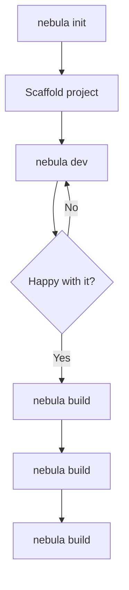
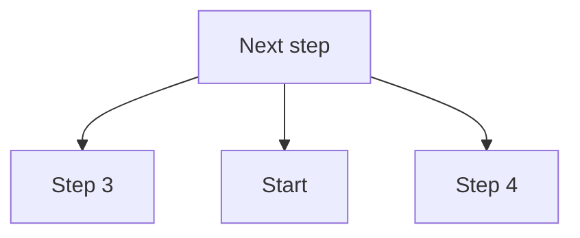
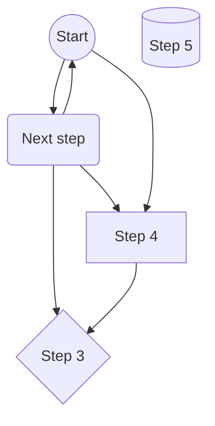

# Nebula CLI

  

A fast, zero-config command line tool for scaffolding and shipping modern web projects.

## Features

- Instant project scaffolding with sensible defaults
- Built-in dev server with hot reloading
- One-command production builds
- Plugin system for custom workflows

## Installation

```bash
npm install -g nebula-cli
nebula init my-app
cd my-app
nebula dev
```

## Usage

| Command | Description |
| --- | --- |
| `nebula init` | Create a new project |
| `nebula dev` | Start the dev server |
| `nebula build` | Build for production |

## How It Works



## Project Structure

```text
my-app/
├── src/
│   ├── components/
│   └── main.ts
├── public/
└── package.json
```

## Roadmap

- [x] Core scaffolding
- [x] Plugin API
- [ ] Remote templates
- [ ] Deploy targets

<details>
<summary>Advanced configuration</summary>

Create a `nebula.config.ts` file at the project root to override defaults.

</details>

> Nebula is under active development. Expect frequent releases.

## Contributing

Pull requests are welcome. Please open an issue first to discuss any major change.

---

## License

MIT © Nebula Contributors

```text
project/
├── src/
├── public/
└── package.json
```


---

<details>
<summary>More information</summary>

Additional content.

</details>




